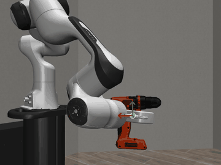
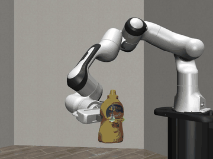
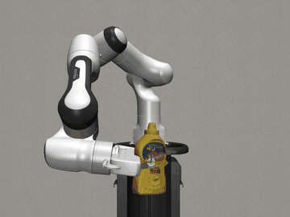
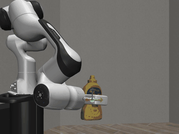
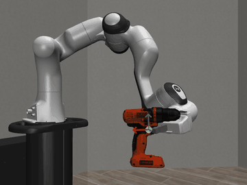
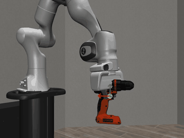
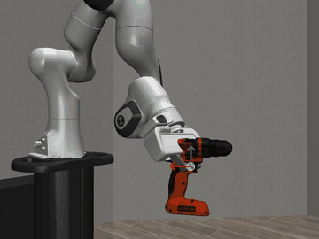
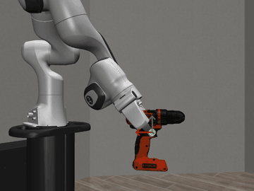
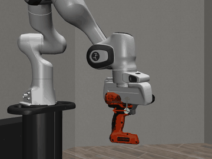

# object_traj

<table>
  <tr>
    <td align="center"><b>Demo</b></td>
    <td align="center"><b>Robot Tracking (same viewpoint)</b></td>
  </tr>
  <tr>
    <td></td>
    <td></td>
  </tr>
</table>

## Setup

### Option 1: `uv`

```bash
SETUPTOOLS_USE_DISTUTILS=local uv sync
source .venv/bin/activate
```

### Option 2: `conda`

```bash
conda env create -f environment.yml
conda activate object-traj
```

### Setup for Franka deployment

After activating the conda env (`object-traj`):

```bash
# ZED SDK Python API
cd "/usr/local/zed/"
python3 get_python_api.py

# DROID
cd droid
pip install -e .

pip install "numpy<2"
```

On a headless server:

```bash
export MUJOCO_GL=egl
```

---

## Configuration — `config.yml`

All shared parameters between simulation and deployment live in `config.yml` at the project root.
Edit this file once and both scripts pick up the changes automatically.
CLI arguments always override config values.

```yaml
data_dir: data/035_power_drill_20200709_151335  # dataset to use

angle: 90                     # camera-to-robot rotation (degrees)
scale: 1.0                    # trajectory scale factor
eef_dir: mz                   # gripper approach: mz / py / my / SPH_lat<a>lon<b>[z<c>]
center_offset: [-0.1, 0.0, 0.1]  # offset from EEF initial position to trajectory center (meters)

# Simulation-specific
steps: 2                      # MuJoCo steps per waypoint
control_freq: 10              # OSC control frequency (Hz)
show_eef: false               # overlay EEF trail and axes on rendered frames

# Deploy-specific
tcp_offset: 0.145             # flange to gripper tip along flange Z (meters, Robotiq85)
```

Place dataset folders inside `data/`:

```
data/
  011_banana_20200709_145401/
  035_power_drill_20200709_151335/
  bowl6/
  ...
```

### SAM3D data format

Datasets recorded with SAM3D have a different directory structure.
Run the conversion script once before using them:

```bash
python simulation/convert_sam3d.py data/bowl6
```

This creates `object_pose/poses.npz`, `camera.json`, `mesh/`, and RGB symlinks
in the standard format expected by both scripts.

---

## `simulation/main_abs.py` — Robosuite Simulation

Loads an object trajectory from a dataset, converts it from camera frame to robot frame,
and replays it in a robosuite (Panda + Robotiq85) simulation using absolute OSC control.
Also generates a dataset trajectory visualization and trajectory plots before running.
Records video from multiple camera views (front, bird, side, dataset_cam) and optionally logs to wandb.

**Key options** (set in `config.yml` or pass as CLI arguments):

| Option | Config key | Default | Description |
|---|---|---|---|
| `data_dir` | `data_dir` | — | Dataset path (relative to project root) |
| `--angle` | `angle` | `90` | Camera horizontal angle in degrees |
| `--eef-dir` | `eef_dir` | `mz` | Initial gripper approach direction |
| `--scale` | `scale` | `1.0` | Trajectory scale factor |
| `--steps` | `steps` | `2` | Simulation steps per waypoint |
| `--control-freq` | `control_freq` | `10` | OSC control frequency (Hz) |
| `--show-eef` | `show_eef` | `false` | Overlay EEF trail and axes |
| `--wandb` | — | off | Enable wandb logging |
| `--ref-dir` | — | — | Reference dataset for mesh orientation correction |

```bash
# Use dataset from config.yml
python simulation/main_abs.py

# Override dataset via CLI
python simulation/main_abs.py data/011_banana_20200709_145401

# With options
python simulation/main_abs.py --angle 45 --eef-dir my --show-eef
python simulation/main_abs.py --steps 20 --scale 2.0
python simulation/main_abs.py --wandb --project my-project --name my-run
```

**Output** (saved to `videos/<run_name>/`):
- `{frontview,birdview,sideview,dataset_cam_<angle>_<eef>}.mp4` — simulation camera views
- `trajectory.mp4` — original dataset frames with projected object trajectory overlaid
- `traj_cam.png` / `traj_robot.png` — per-frame pose plots in camera / robot frame

### Mesh orientation correction (`--ref-dir`)

Different pose estimators define the object coordinate frame differently relative to the mesh `.obj` file.
`--ref-dir` fixes this by computing the rotation offset between the reference estimator and the current one at frame 0:

```
R_body_offset = R_ref_cam(frame0).T @ R_cur_cam(frame0)
quat0_mesh    = quat[0] * R_body_offset⁻¹
```

```bash
python simulation/main_abs.py data/freepose --ref-dir data/ours --angle 45 --eef-dir my
```

---

## `deploy_franka/main.py` — Real Robot Deployment

Loads the same trajectory and replays it on a physical Franka Panda via DROID's `RobotEnv`.
Reads shared parameters (`data_dir`, `angle`, `scale`, `eef_dir`, `center_offset`) from `config.yml`.

TCP offset (`tcp_offset`) accounts for the distance from the flange to the Robotiq85 gripper tip.

```bash
# Use config.yml settings
python deploy_franka/main.py

# Override via CLI
python deploy_franka/main.py data/011_banana_20200709_145401 --angle 45 --eef-dir my
```

A live camera preview is shown before execution starts — press **Enter** to begin the trajectory.
Video is recorded from the varied camera and saved to `videos/<run_name>/deploy_video.mp4`.

---

## Multi-angle Comparison

The `angle` parameter controls where the camera is placed relative to the robot:

<table>
  <tr>
    <td align="center"><b>--angle -50</b></td>
    <td align="center"><b>--angle 0</b></td>
    <td align="center"><b>--angle 50</b></td>
  </tr>
  <tr>
    <td></td>
    <td></td>
    <td></td>
  </tr>
</table>

## Gripper Orientation Comparison

The `eef_dir` parameter controls the initial gripper approach direction:

<table>
  <tr>
    <td align="center"><b>eef_dir: my</b></td>
    <td align="center"><b>eef_dir: mz (default)</b></td>
    <td align="center"><b>eef_dir: py</b></td>
  </tr>
  <tr>
    <td></td>
    <td></td>
    <td></td>
  </tr>
</table>

Spherical coordinate mode (`SPH_lat<a>lon<b>[z<c>]`) lets you specify the gripper direction
by latitude, longitude, and an optional spin around the approach axis:

<table>
  <tr>
    <td align="center"><b>SPH_lat150lon0z0</b></td>
    <td align="center"><b>SPH_lat150lon30z0</b></td>
    <td align="center"><b>SPH_lat180lon0z0</b></td>
    <td align="center"><b>SPH_lat180lon0z90</b></td>
  </tr>
  <tr>
    <td></td>
    <td></td>
    <td></td>
    <td></td>
  </tr>
</table>
