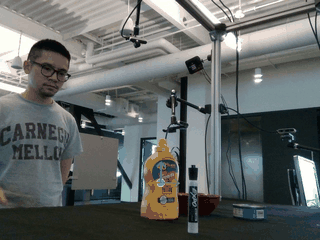
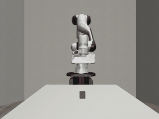

# object_traj

### The "dataset_cam" view shows the robot arm following the trajectory from the same viewpoint as the camera in the dataset

<table>
  <tr>
    <td align="center"><b>Demo</b></td>
    <td align="center"><b>Robot Tracking (same viewpoint)</b></td>
  </tr>
  <tr>
    <td></td>
    <td></td>
  </tr>
</table>

## Setup

```bash
uv sync
source .venv/bin/activate
```

---

## `src/visualize_dataset.py` — Dataset Visualization

Loads recorded object pose data (`poses.npz`) and RGB images from a dataset folder,
projects the 3D object trajectory onto each frame, and saves it as a video.

- Draws the object's position as a dot with a trailing path
- Draws XYZ axes of the object frame on each frame (red=X, green=Y, blue=Z)
- Output is saved to `videos/<dataset_name>/trajectory.mp4`

```bash
python src/visualize_dataset.py
python src/visualize_dataset.py data/006_mustard_bottle_20200709_143211
python src/visualize_dataset.py data/006_mustard_bottle_20200709_143211 --fps 20
```

---

## `src/simulate/main.py` — Robosuite Simulation

Loads an object trajectory from a dataset, converts it from camera frame to robot frame,
and replays it in a robosuite (Panda) simulation using OSC control.
Records video from three camera views (front, bird, side) and optionally logs to wandb.

- `--pos-only`: follow position only, keep the arm's initial orientation (ignore object rotation)
- `--scale`: scale factor for trajectory size in robot space (default: 1.5)
- `--steps`: number of simulation steps per waypoint (default: 10)
- `--no-wandb`: skip wandb logging

```bash
python src/simulate/main.py --no-wandb --pos-only
python src/simulate/main.py data/006_mustard_bottle_20200709_143211 --no-wandb
python src/simulate/main.py data/006_mustard_bottle_20200709_143211 --steps 20 --scale 2.0
python src/simulate/main.py data/006_mustard_bottle_20200709_143211 --video-dir videos --project my-project --name my-run
```

Output: `videos/<run_name>/{frontview,birdview,sideview}.mp4`
