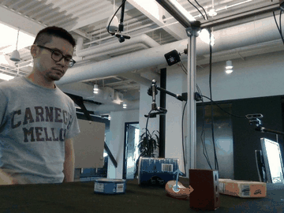
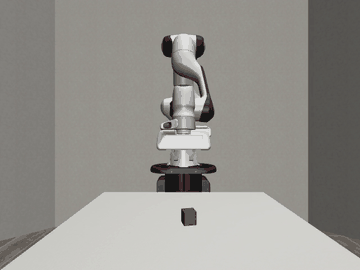

# object_traj

<table>
  <tr>
    <td align="center"><b>Demo</b></td>
    <td align="center"><b>Robot Tracking (same viewpoint)</b></td>
  </tr>
  <tr>
    <td></td>
    <td></td>
  </tr>
</table>

## Setup

```bash
uv sync
source .venv/bin/activate
```

Place dataset folders inside `data/`:

```
data/
  011_banana_20200709_145401/
  035_power_drill_20200709_151335/
  ...
```

---

## `src/main.py` — Robosuite Simulation

Loads an object trajectory from a dataset, converts it from camera frame to robot frame,
and replays it in a robosuite (Panda) simulation using OSC control.
Also generates a dataset trajectory visualization (`trajectory.mp4`) before running the simulation.
Records video from multiple camera views (front, bird, side, dataset_cam) and optionally logs to wandb.

**Options:**
- `--show-eef`: overlay EEF trail and orientation axes on all camera views
- `--angle`: horizontal camera angle in degrees (0=head-on, +90=robot's right, -90=robot's left)
- `--scale`: scale factor for trajectory size in robot space (default: 1.0)
- `--steps`: simulation steps per waypoint (default: 2; fewer steps = faster but larger error)
- `--no-wandb`: skip wandb logging

```bash
python src/main.py --no-wandb
python src/main.py data/011_banana_20200709_145401 --no-wandb
python src/main.py data/011_banana_20200709_145401 --angle 45 --show-eef --no-wandb
python src/main.py data/011_banana_20200709_145401 --steps 20 --scale 2.0
python src/main.py data/011_banana_20200709_145401 --video-dir videos --project my-project --name my-run
```

Output:
- `videos/<run_name>/{frontview,birdview,sideview,dataset_cam}.mp4` — simulation camera views
- `videos/<run_name>/trajectory.mp4` — original dataset frames with projected object trajectory overlaid

`dataset_cam.mp4` is rendered from the same point of view as the camera used to record the original dataset.
